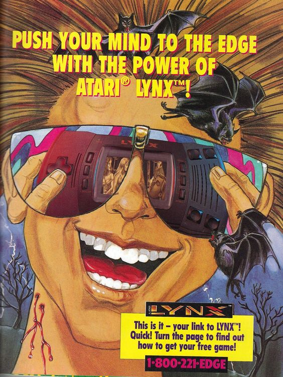

After further research, investigation and experimentation into the subject, I’ve managed to dig up an excellent Atari Lynx Game developed by a Lynx coding guru (an extremely rare species indeed) who is from Finland and  goes by the name of Karri Kaksonen. 

Karri developed an Atari lynx version of the classic pong game for a Finnish games competition back in 2012. He has ope sourced the original codebase on the AtariAge forums.

I have ported the original codebase so it can be run on Mac OSX using Visual Studio code and have made this port available here: https://github.com/JPHUNTER/LynxBoilerplate

What I appreciate the most about this particular project is that it has been laid out in a very understandable and modular framework. 

Being a very small game it makes for an excellent template by which to use for a boilerplate  and this is exactly what I will be doing for my own soon to be announced Atari Lynx Title.

My next step will be to set about editing some graphics either using sprpck or sp65. From my understanding, sprocket is best and easiest when dealing with bitmaps but sp65 is more modern and deals with converting pcx files instead of bitmaps. sp65 is another tool that has been developed for by Karri.

If i stick with sprpck, I’ve discovered its best to use Gimp for image creation as photoshop adds custom headers that mess up the sprpck conversion process.

Anyway, I’ll send up an additional update once I’ve made tracks.

