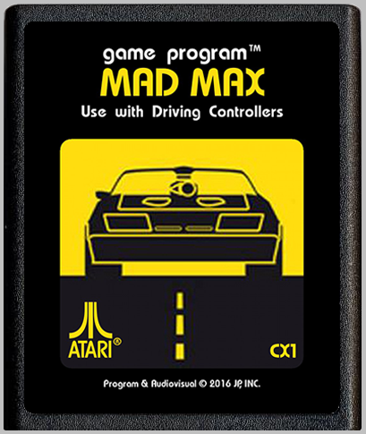
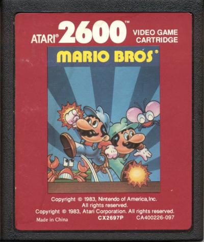

Hey everyone check out this custom Mad Max Interceptor ROM for the Atari2600. 

You get to hoon around in the Mad Max Interceptor after a violent and merciless blur where the Toecutters ran down Max’s wife and infant child.

Max was once an officer of the law but the Toecutters keep getting out and killing more people.  Now Max is out to stop them from ever harming anyone else, enter the the Road Warrior!

They ride on their motor cycles towards you , you must run them down but watch out for the trucks if you hit too many trucks your car is destroyed and it’s game over for Max!

This is a work in progress right now.

It is looking pretty nice, although I wish there were big sprites like in Activision’s Grand Prix.

How they did that I don’t know there is a limit 8 pixels wide for sprites.

Everything still looks pretty good I think.

Oh yeah, The trucks look cool! 

Play Mad Max for the Atari 2600 [here](https://security-guard-broadcast-74123.netlify.com/release/index.html?name=max "Mad Max Atari 2600") now!

By the way, would you believe that Mario Bros was released for the Atari 2600 way back in 1983 even before there was any Nintendo Entertainment System?
Check it out for youself using the link below!

Play Mario Bros for the Atari 2600 [here](https://security-guard-broadcast-74123.netlify.com/release/index.html?name=mario "Mario Bros Atari 2600") now!

    

    

