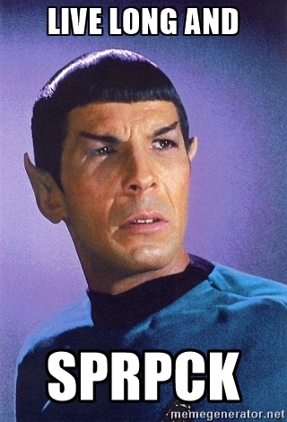

While working on getting an OSX based Atari Lynx project boilerplate setup , I have hit a blocker.

My research has uncovered a reference a tool for creating sprite pixel data by the name of sprpck.  This is the easiest way to create the Atari lynx sprite pixel and data structure.

This tool relies on a bitmap image for conversion. Sprpck supports bitmap files with 4, 8 and 24-bit colours. Atari Lynx games contain several bitmaps that get turned into binary object files.

Sprpck knows about the packing formats that the Lynx uses. and works exclusively for Atari Lynx sprite data. 

Last released as version 1.98  on the 18th of August 1998, there has ofcourse been no version released that will build on  64bit Mac OSX, let alone work. Until now that is,

Necessity being the mother of all  invention has forced my hand and I’ve forked a repo into my github account that you can use  should you also wish to go down the path of Atari Lynx Games Development on Mac OSX.

This version was forked from Wookie who has adjusted its makefile to properly execute on Unix based systems.  I have again modified it to execute properly on arch Mac OSX 64bit.  

Visit my github repo for more info.

